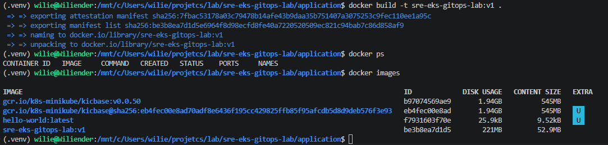
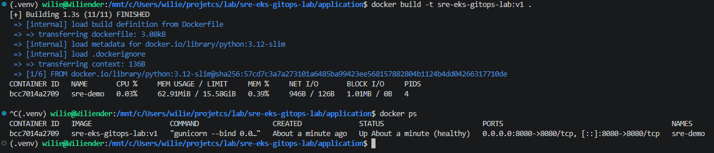
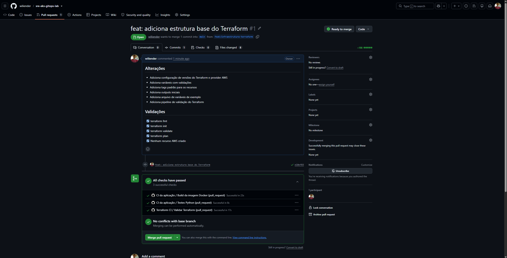
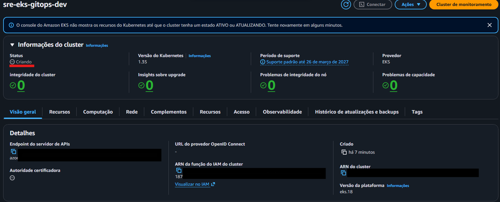
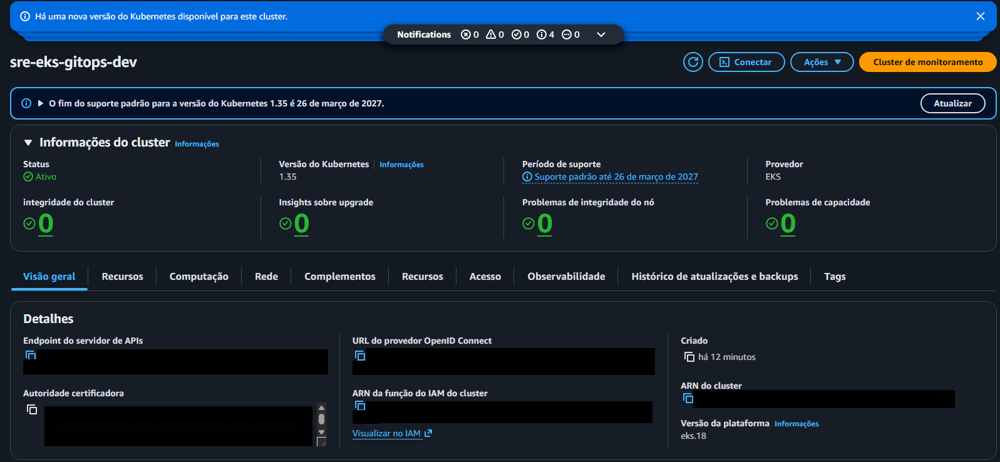
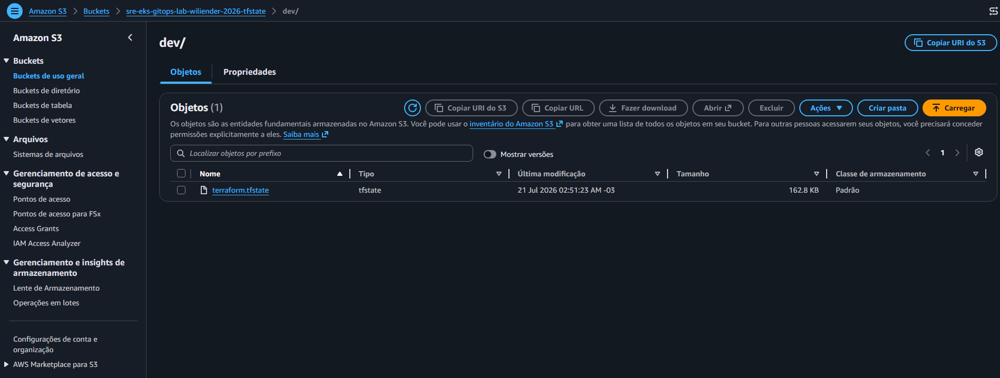
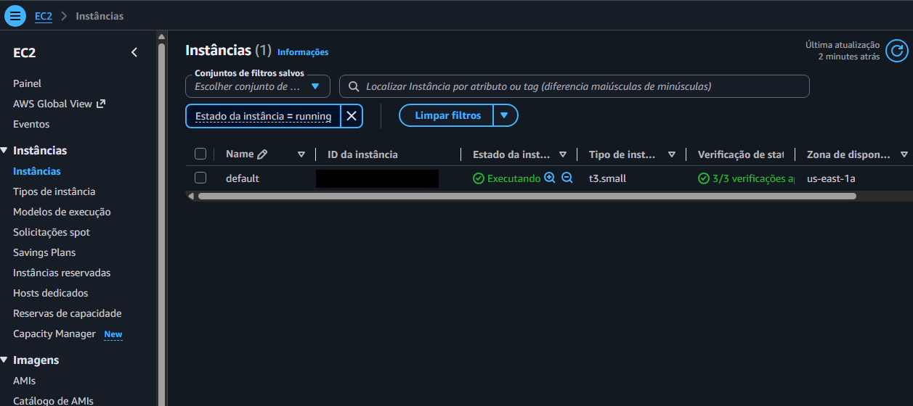

# SRE EKS GitOps Lab

Projeto prático de SRE para demonstrar provisionamento de infraestrutura,
Kubernetes, integração contínua, GitOps e observabilidade.

## Objetivo

Provisionar um cluster Amazon EKS utilizando Terraform, realizar o deploy
de uma aplicação com ArgoCD e monitorar o ambiente com Prometheus e Grafana.

## Tecnologias

- AWS
- Amazon EKS
- Terraform
- Kubernetes
- Docker
- GitHub Actions
- ArgoCD
- Prometheus
- Grafana
- Python
- Flask

## Arquitetura

O Terraform será responsável pelo provisionamento da infraestrutura AWS e
do cluster EKS.

O GitHub Actions executará testes, validações e a construção da imagem
Docker da aplicação.

O ArgoCD utilizará o repositório Git como fonte da verdade e sincronizará
os manifestos Kubernetes com o cluster.

O Prometheus coletará métricas da aplicação e do cluster, enquanto o
Grafana será utilizado para visualização e investigação.

## Endpoints

| Endpoint | Descrição |
|---|---|
| `/` | Informações da aplicação |
| `/health` | Health check |
| `/metrics` | Métricas Prometheus |
| `/simulate-latency` | Simulação de latência |
| `/simulate-error` | Simulação de erro HTTP 500 |

# Roadmap

## Aplicação

- [x] Criar estrutura inicial
- [x] Criar aplicação Flask
- [x] Adicionar endpoint de Health Check
- [x] Adicionar métricas Prometheus
- [x] Adicionar testes automatizados
- [x] Criar Dockerfile
- [x] Executar aplicação em container

## CI/CD

- [x] Criar pipeline de testes no GitHub Actions
- [x] Validar build da imagem Docker

## Infraestrutura AWS

- [x] Criar infraestrutura com Terraform
- [x] Configurar backend remoto do Terraform (S3 + DynamoDB)
- [x] Criar VPC
- [x] Criar cluster Amazon EKS
- [x] Criar Managed Node Group
- [x] Configurar acesso ao cluster (kubectl)

## Kubernetes

- [ ] Criar namespace da aplicação
- [ ] Criar Deployment
- [ ] Criar Service
- [ ] Realizar deploy da aplicação no EKS

## GitOps

- [ ] Instalar ArgoCD
- [ ] Configurar sincronização GitOps

## Observabilidade

- [ ] Instalar Prometheus
- [ ] Instalar Grafana
- [ ] Criar dashboards
- [ ] Configurar alertas

## Finalização

- [ ] Documentar arquitetura
- [ ] Criar diagrama da infraestrutura

## Executar com Docker

Construa a imagem:

```bash
docker build -t sre-eks-gitops-lab:v1 ./application
```





Pull Request da estrutura base do Terraform validado com sucesso. Todos os pipelines (CI da aplicação e Terraform CI) foram executados sem falhas, garantindo a qualidade antes da integração na branch principal.



Criando o eks cluster





tfstate salvo no bucket



Maquina EC2 Provisionada

